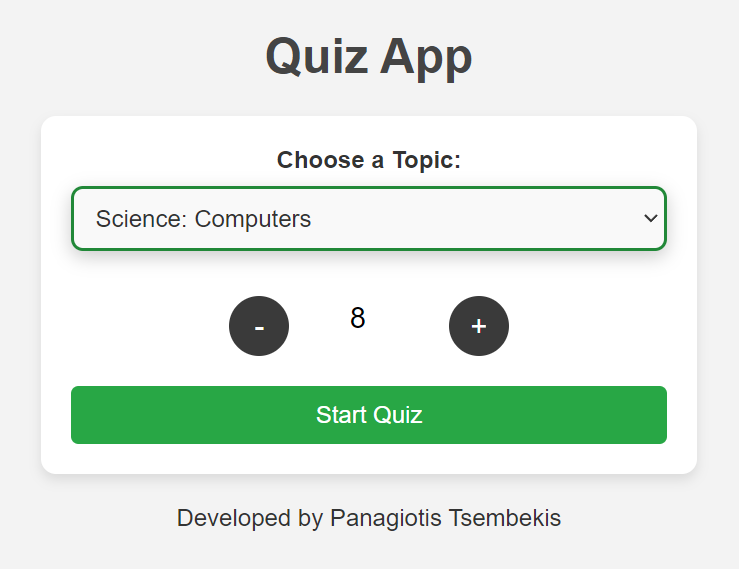
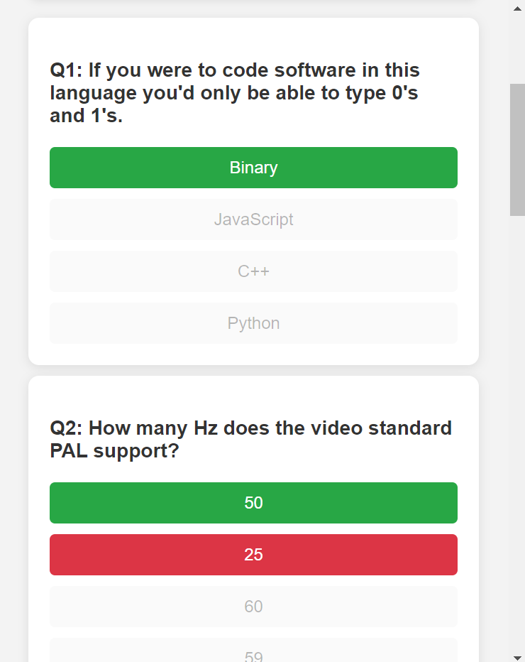
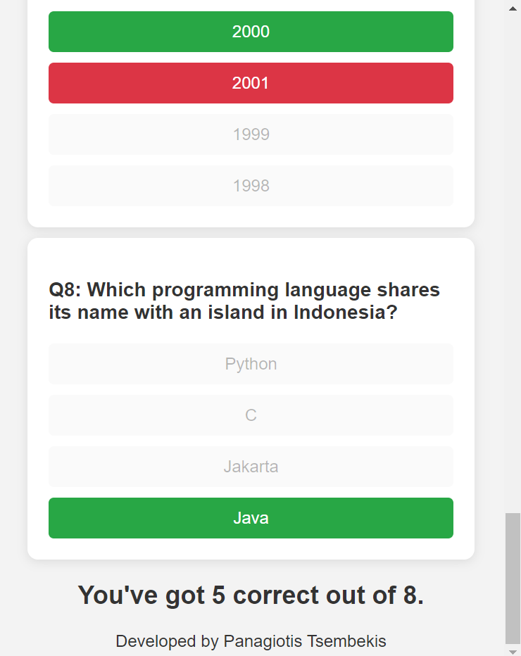

# 🎯 Trivia Quiz App

This is a **Trivia Quiz App** built using **HTML, CSS, and JavaScript**, allowing users to select a quiz category and test their knowledge with multiple-choice questions fetched from the **Open Trivia Database API**.

## 📸 Screenshots

## 📚 Features

- ✅ Select a quiz category from a dropdown to fetch questions about.
- ✅ Select number of questions to be generated.
- ✅ Highlight correct and wrong answers.
- ✅ Score calculation.
- ✅ Edge case handling such as preventing multiple selections after answering.

