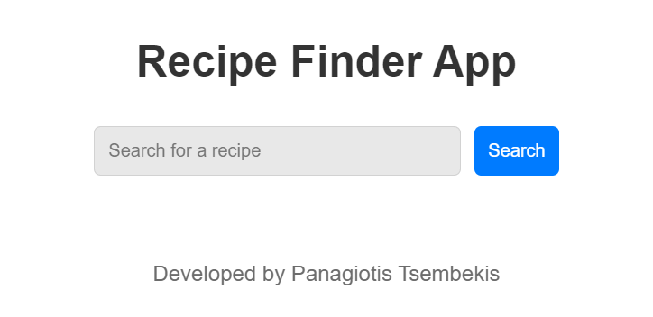
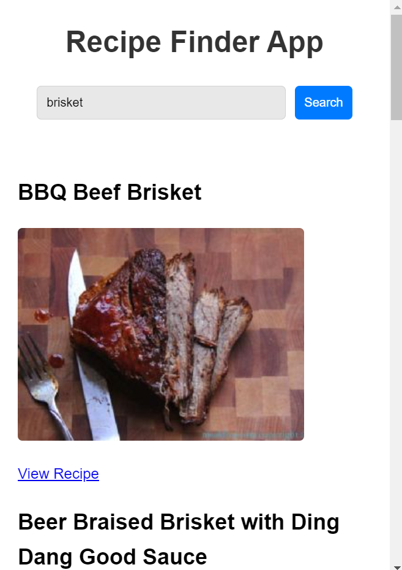
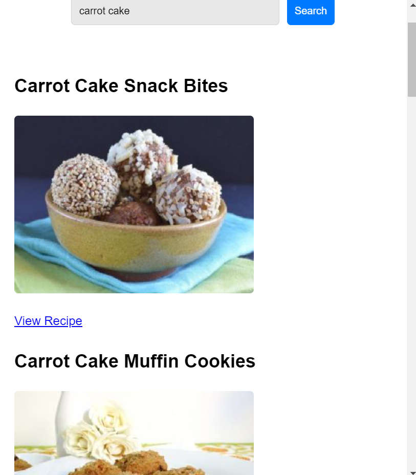

# 🍴 Recipe Finder App

This is a **Recipe Finder Web App** built using **HTML, CSS, and JavaScript**. It allows users to search for recipes by name and fetches results from the **Spoonacular API**.

## 📸 Screenshots

## 🚀 Features
- Search for recipes using a keyword.
- Fetches recipes from the **Spoonacular API**.
- Displays recipe images and a link to view the full recipe.
- Clean and responsive design.